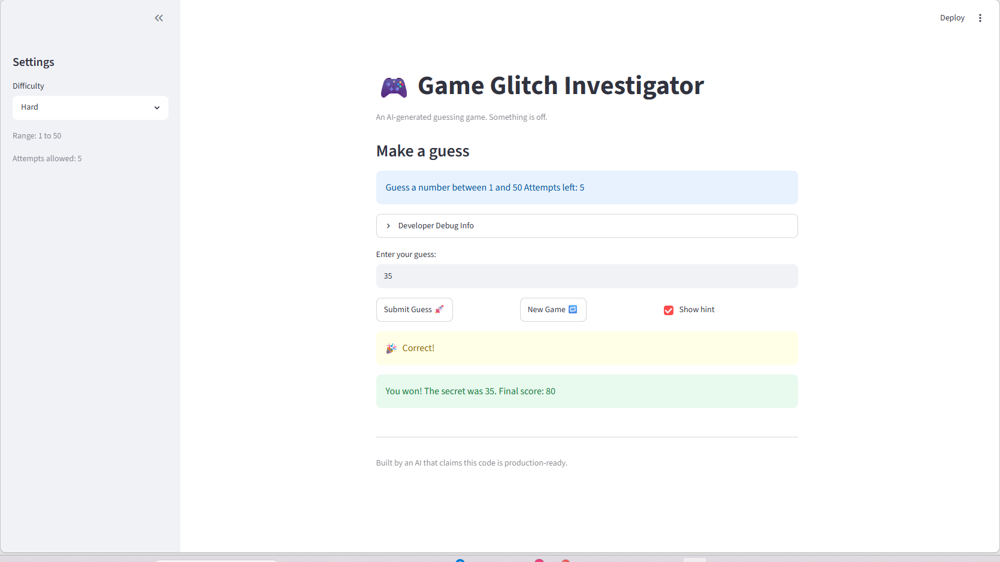

# 🎮 Game Glitch Investigator: The Impossible Guesser

## 🚨 The Situation

You asked an AI to build a simple "Number Guessing Game" using Streamlit.
It wrote the code, ran away, and now the game is unplayable. 

- You can't win.
- The hints lie to you.
- The secret number seems to have commitment issues.

## 🛠️ Setup

1. Install dependencies: `pip install -r requirements.txt`
2. Run the broken app: `python -m streamlit run app.py`

## 🕵️‍♂️ Your Mission

1. **Play the game.** Open the "Developer Debug Info" tab in the app to see the secret number. Try to win.
2. **Find the State Bug.** Why does the secret number change every time you click "Submit"? Ask ChatGPT: *"How do I keep a variable from resetting in Streamlit when I click a button?"*
3. **Fix the Logic.** The hints ("Higher/Lower") are wrong. Fix them.
4. **Refactor & Test.** - Move the logic into `logic_utils.py`.
   - Run `pytest` in your terminal.
   - Keep fixing until all tests pass!

## 📝 Document Your Experience

- [ ] Describe the game's purpose.
- [ ] Detail which bugs you found.
- [ ] Explain what fixes you applied.

## 📸 Demo Walkthrough

Describe your fixed game in numbered steps so a reader can follow along without watching a video:

1. Launch the game via the streamlit command.
2. Select the appropriate difficulty for you, select 'New Game' to generate new game with the appropriate difficulty
3. Begin guesss! By default the game will guide you with hints, but you can unselect the hint button to turn off this feature
4. Guess until you will, or lose, enter your guess in the guess box and submit your guess
5. Click new game to start a new game

**Screenshot** *(optional)*: <!-- Insert a screenshot of your fixed, winning game here -->


## 🧪 Test Results

```
========================================================================================== test session starts ==========================================================================================
platform win32 -- Python 3.13.7, pytest-9.0.3, pluggy-1.6.0 -- C:\Users\yang1\AppData\Local\Programs\Python\Python313\python.exe
cachedir: .pytest_cache
rootdir: C:\Users\yang1\Documents\AI101\ai110-module1show-gameglitchinvestigator-starter
configfile: pytest.ini
plugins: anyio-4.13.0
collected 4 items                                                                                                                                                                                        

tests/test_game_logic.py::test_get_range_for_difficulty PASSED                                                                                                                                     [ 25%]
tests/test_game_logic.py::test_parse_guess PASSED                                                                                                                                                  [ 50%]
tests/test_game_logic.py::test_check_guess PASSED                                                                                                                                                  [ 75%]
tests/test_game_logic.py::test_update_score PASSED                                                                                                                                                 [100%]

=========================================================================================== 4 passed in 0.04s ===========================================================================================
```

## 🚀 Stretch Features

- [ ] [If you choose to complete Challenge 4, describe the Enhanced UI changes here — a screenshot is optional]
